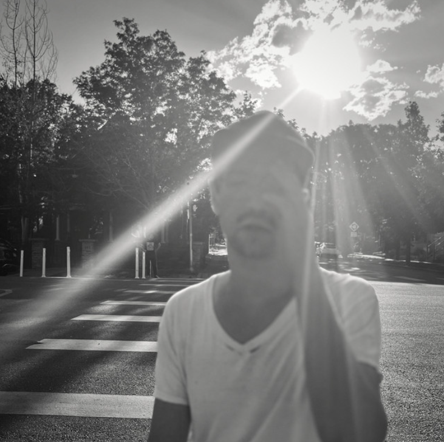

    
        <h2 class="artist">Darwin Deez</h2> 
        <h2 class="title">Diskographie</h2>
        <h3 class="headline">Eine ungewöhnliche Empfehlung für einen ungewöhnlichen Künstler</h3>

Musik ist Kunst, doch das vergisst man allzu oft. Zumeist dann, wenn man eine Reihe belangloser und formelhaft geschriebener "Bloß-nicht-anecken-Pop-Songs" hören musste. Man erinnert sich aber auch wieder daran, wenn man die musikalischen Ergüsse von Künstler*innen wie <strong>Darwin Deez</strong> hört. Anlässlich seines neuen Albums <em>Of Course I Still Love You</em> ist es doch höchste Zeit, mal genauer hinzuhören. Nicht nur in das inzwischen fünfte Album, sondern in die gesamte Diskografie.

Was also macht diese so besonders oder anders, dass ich hier das bedeutungsschwangere Wort "Kunst" verwende? Zunächst halten wir fest: <strong>Darwin Deez</strong> trifft die ungewöhnlichen Entscheidungen. Seine Songs verlangen viel Aufmerksamkeit und Toleranz gegenüber wilden Melodien und schon fast anstrengenden Sounds. Vielleicht braucht es sogar 2-3 Hördurchgänge bis es klickt, aber wenn es das tut, dann richtig. Das Hauptinstrument ist der Synthesizer, aber in einer selten zu hörenden Art. Er springt, klimpert und hat so viel zu erzählen und das, obwohl die Inhaltsebene restlos durch die Lyrics bespielt wird.
 

        Press my face against the glass and make fog;
        As it evaporates I wait for my message to dissolve;
        I'm debating with the buzzer whether to buzz or not;
        And all I ever do is cycle through the same few thoughts;
    

    - The Numbers

        I'm orbiting your waist throughout the day
        So maybe love is orbital decay
        My heart's a-flame with atmospheric drag
        As I'm an astronaut about to plant my flag
    

    - The World's Best Kisser

Es sind Passagen wie diese, die klare Bilder erzeugen und doch so angenehm selten gehört sind. Die Musik von <strong>Darwin Deez</strong> kitzelt das Gehirn in der genau richtigen Weise, wenn man sie denn lässt. Naturgemäß lassen sie das aber die wenigsten und so kommt es, dass sich <strong>Deez</strong> mit einer zwar treuen aber kleinen Fanbase begnügen muss. Für die Fans mag das vielleicht sogar eine gute Sache sein, doch erscheint es wie so oft einfach ungerecht. Immerhin erzielte <strong>Deez</strong> mit seinem Erstling "Darwin Deez" von 2010 einigermaßen beachtliche Erfolge und Songs wie "Constellations" oder "Radar Detector" verlassen den Gehörgang nach dem Hören nur mit Gewalt.

<strong>Darwin Deez</strong> ist nischig und seine Musik wird bei einigen kaum gehört abprallen, doch es lohnt sich wirklich einen zweiten Blick zu riskieren. Die Hörempfehlung soll also Diskografie-umfassend sein, jedoch stelle ich hier mal das neue Werk in den Vordergrund, da es mit einem Releasedatum wie Dienstag dem 17.12.2024 naturgemäß weniger Aufmerksamkeit erhält. Selbst hier trifft <strong>Darwin Deez</strong> die ungewöhnlichen Entscheidungen.

