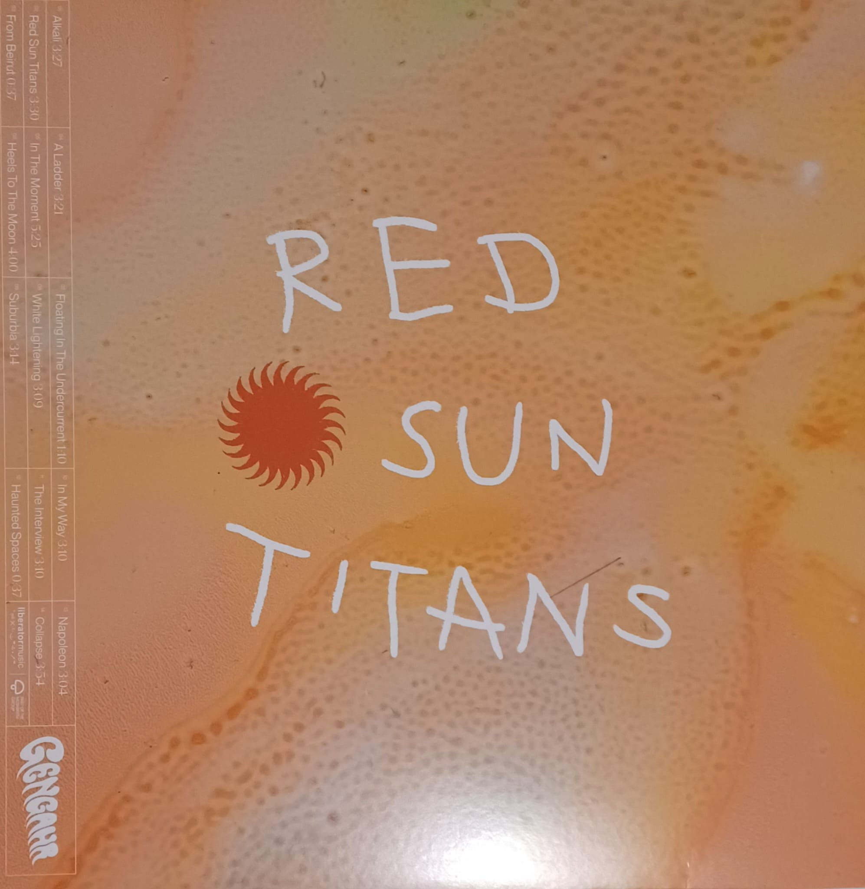

    
        <h2 class="artist">Gengahr</h2> 
        <h2 class="title">Red Sun Titans</h2>
        <h3 class="headline">Wenn Geister zum Träumen einladen</h3>

Als <strong>Gengahr</strong> bereits vor Erscheinen ihres Debüts A Dream Outside für das Glastonbury '14 gebucht wurden, erhoben sich kühne Stimmen, die in der vierköpfigen Psychedelic Pop-Gruppe die „Rettung der britischen Gitarrenmusik“ sahen. 8 Jahre später erschien ihr aktuelles Album Red Sun Titans und zeigte deutlich, woher diese Stimmen kamen, auch wenn sich die Band, die nach einem Geist-Pokémon der ersten Generation benannt ist, weiterentwickelt hat und heute eher dem Dream-Pop zuzuschreiben ist.

Natürlich findet sich auf <em>Red Sun Titans</em> wieder so manch feiner Saitenschlag, doch verschwimmt die Grenze zwischen Gitarre und Synth. Für das ungeübte Ohr sind die grundsätzlich verzerrten, entfremdeten und aller Regel nach unüblichen Klänge nur schwer einem Instrumententypus zuzuordnen. Gitarrenmusikrettung ist das ganz sicher nicht, dafür aber phänomenal gut. Die Tracks auf <em>Red Sun Titans</em> wollen eingängig sein, aber nicht langweilen. Sie mögen stellenweise reizüberfluten und regen doch zum Träumen an. Wer sich nicht bereits in den teils ätherischen Instrumentals verliert, wird spätestens durch die selten profanen Lyrics auf Reisen geschickt.
 

  

       Outshone
       Heaven grieved
        Acces denied
        Unwound
        A jealous decree
        Unusually loud
    

    - Alkali

  

        In the light you say
        Here's to the one I don't wanna be
        For the righteous game
        Heels to the moon now
    

    - Heels To The Moon

<em>Red Sun Titans</em> bietet poppige Hits ebenso wie experimentelle Soundscapes, regelmäßig durchbrochen durch Interludes, die teilweise irritieren sollen und die Brücke zur angesprochenen Geist-Thematik schlagen. Nicht nur aufgrund Titel wie "Haunted Spaces - Interlude". Über allem thront aber vor allem diese fragile Melancholie. Egal womit sich die Songs nun beschäftigen, egal ob Upbeat oder Ballade - jeder Track vermag eine wohlige tröstende Wärme auszulösen - trotz teilweise beunruhigender Lyrics.

  

        Can't stop too long
        Out here they kill to belong
        Got cash to burn
        In a car they don't make anymore
    

    - Napoleon

Wer sich bis hier hin noch gewehrt hat und am Hier und Jetzt festhält, erhält mit dem Albumcloser "Collapse" dann die finale Einladung, sich fallen zu lassen und den Trubel des Alltags für einen Moment zu vergessen. Letztlich ist es doch genau das, was wir aktuell brauchen - im Gegensatz zur Rettung britischer Gitarrenmusik.

