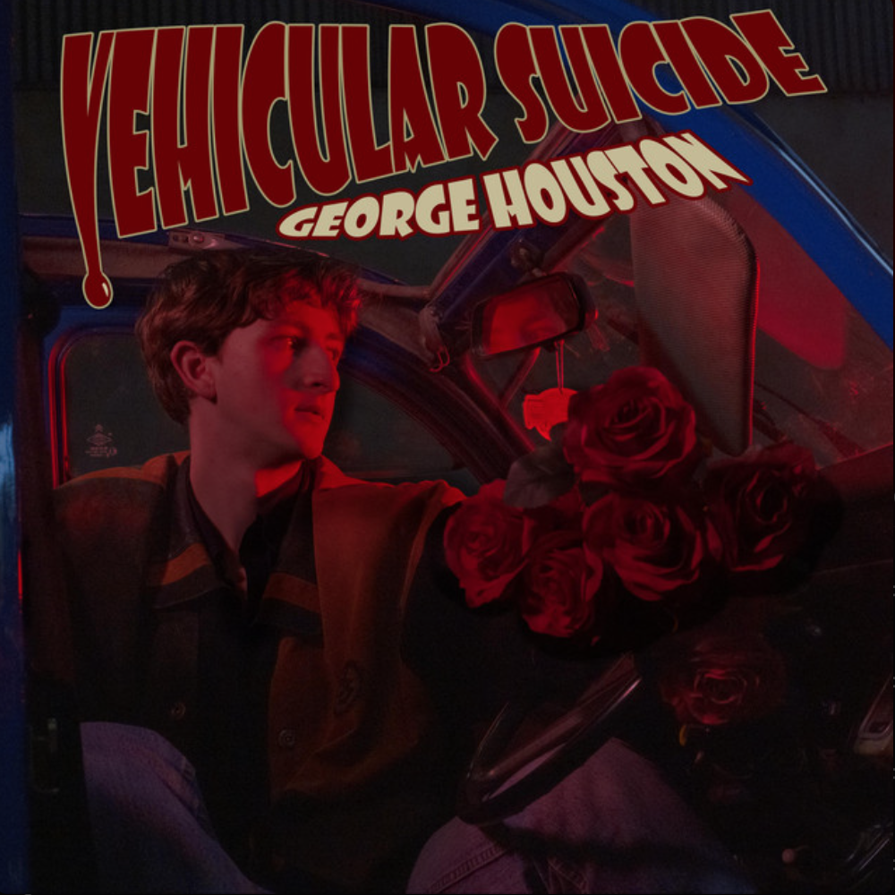

        <h2 class="artist">George Houston</h2> 
        <h2 class="title">Vehicular Suicide</h2>
        <h3 class="headline">Eine energetisch-enigmatische alte Seele im Konflikt mit der Liebe und der Grenze zwischen Anbetung und Aufopferung</h3>

Der junge Singer-Songwriter aus Donegal, Irland überzeugt mit beeindruckend ausgereiftem und informiert klingendem Sound und erzählt dabei Geschichten von der Liebe und ihrem Talent das Individuum und die Paare, die ihr verfallen durch sämtliche Ebenen des Fühlbaren zu katapultieren. Dass <strong>Houston</strong> viel Zeit mit dem Studieren der elterlichen Plattensammlung verbracht hat, ist etwas das man seiner Musik sehr genau anhören kann, denn aufmerksame HörerInnen merken schnell – dieser Typ weiß genau, was er tut.

Beschreiben könnte man das als eine Art „eklektischer Indie-Folk-Pop“ oder so ähnlich, ist aber ja auch total nebensächlich. Denn wichtig ist, es funktioniert und weiß zu begeistern. Einflüsse bahnen sich an, sowohl aus Strömungen von intelligent durchdachtem Folk-Songwriting, eingängigen, zum Bewegen anstiftenden Pop-Elementen als auch einer Aura von amerikanischem Country à la Johnny Cash oder Hank Williams, verpackt in einem modernen Gewand, welches dann trotzdem irgendwie so klingt als käme es aus den Sechzigern zu uns. Mit dem titelgebenden Song „Vehicular Suicide“ und „Pain“ wirft Houston uns zwischen Wahnsinn und Schmerz direkt sehr energetisch in medias res und fast wirkt es als würde seine markant-volle Stimme über die Musik tanzen. Habe ich schon erwähnt dass seine Musik auch ganz schön weird ist? Denn das ist gar nicht mal so unwichtig... wie entschuldigungslos und befreit der Ire musiziert und seine Gedanken zum Ausdruck bringt ist einfach erfrischend ehrlich.
 

  

        I bet life’s oh so pleasant
        Kicking back in your antidepressants
        Just wish they didn’t change the way
        You feel about me
       Wishful thinking
        That’s my thing...
    

    - In Aeternum Vive

Etwas melancholischer wird es darauf mit „In Aeternum Vive“, der Single, die mich damals überhaupt erst auf <strong>George Houston</strong> aufmerksam gemacht hat. Es ist nicht immer so einfach zu sagen, was genau einem an einem bestimmtem Song so gut gefällt, dass man ihn immer und immer wieder hört, bis man zu vergessen scheint dass es eine Zeit im Leben gab, bevor er ein Teil davon wurde. Wahrscheinlich habe ich mich damals einfach sehr verstanden gefühlt, von diesem Lied, in welchem die Schwierigkeiten zweier sich liebender Menschen mit der Zuneigung füreinander kontrastieren und sie dazu zwingen zu überdenken, wie gut beide wirklich füreinander sind. Welche Auswirkungen eine solche Beziehung haben kann zeigen auch die nächsten Songs „RedruM“, der thematisch und stilistisch an eine klassische Murder Ballad erinnert und „White Fang“, in dem versucht wird voneinander loszulassen, um sich nicht noch mehr zu schaden.

  

        Cause that’s all that I need –
        Another fucking love song
        And cherubs shitting on me...
    

    - Oh Happy Dagger

Dass auch Entscheidungen, die für das einvernehmlich Gute oder zumindest „Bessere“ getroffen werden schmerzen können, hören wir in „Oh Happy Dagger“, bevor wir in „Roots Grow Out“ so langsam wieder zu lernen beginnen, dass die Welt unter dem ganzen Schmerz immer noch ihre schöneren Seiten hat, die einen fast dazu verleiten könnten wieder etwas optimistischer in die Zukunft zu blicken: 

  

        It’s still there – the sun is still shining...
    

   - Roots Grow Out

Insgesamt ist <strong>George Houstons</strong> „Vehicular Suicide“ ein weiteres Argument dafür sich ab und zu die Zeit zu nehmen einem Album die Chance zu geben es in Gänze durchzuhören und sich im Gesamtkontext zu entfalten.

Am Ende noch ein Tipp: Die neue Single „San Francisco“ von <strong>George Houston</strong> erscheint am 14. Februar..

