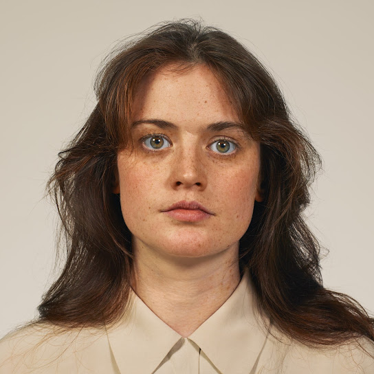

<h2 class="artist">TOPS</h2> 
<h2 class="title">I Feel Alive</h2>
<h3 class="headline">Aller Guten Dinge sind vier</h3>

Ja, es stimmt. <strong>Indie.hose</strong> hat ein Herz für <strong>TOPS</strong>. 
Sie laufen bei uns im Radio, waren im letztjährigen Adventskalender vertreten und das 2025 erschiene Album <em>bury the key</em> schaffte es in unsere <a href="https://www.radio-indie-hose.de/article.html?file=content%2Feoy2025.md" target="_blank">Jahresendliste</a>. 
Da bleibt die berechtigte Frage: Wo ist die Hörempfehlung? Fragt nicht länger, hier kommt sie ja schon.

Heute erkennen wir die 4-köpfige Dreampop-Band aus Montreal vor allem an dem vielseitigen Einsatz verschiedener Flöten. Doch wer den Weg des ursprünglichen Trios schon länger verfolgt, wird wissen dass dem nicht immer so war. Schließlich galten <strong>TOPS</strong> zunächst doch eher als spannendes Indie-Gitarren-Projekt, das dem Singer-Songwriterfeld eine völlig neue Note verlieh. Mit dem Eintritt von Marta Cikojevic als viertes festes Mitglied konnte sich Frontfrau Jane Penney im Songwritingprozess für das vierte Album jedoch endlich ihrer geliebten Flöte widmen und den charakteristischen Sound prägen der seit <em>I Feel Alive</em> so eng mit <strong>TOPS</strong> verbunden ist. 
Doch genug der Geschichte… Was gefällt uns an <strong>TOPS</strong> bzw. konkret dem vierten Album <em>I Feel Alive</em> so gut?

  

    Conversation that I did not like;
    Faces in the street I wish didn't recognize;
    I feel alive
  

  - I Feel Alive

Neben der herrlich ironischen Komponente aus dem Widerspruch des Titels "I Feel Alive" und der aber eher melancholisch bis traurigen Gesangsperformance von Penney klingt das Album deutlich aufgeräumter als seine Vorgänger und gewährt den teils verrückten Melodien mehr Raum. Die nun deutlich stärker vertretenden Keys fügen jedem Lied eine nicht mehr zu missen wollende Note hinzu. Dazu streuen <strong>TOPS</strong> dieses Mal auch vereinzelt Elemente des Disco ein. Wie immer erinnert Penneys Gesang und die gesamte Instrumentierung an ihr großes Vorbild Fleetwood Mac bzw. Stevie Nicks. Perfekter Soft Rock im Dreampopgewand. Und ein besonderes Highlight: dieser absolut ergreifende Synthbass in "Colder & Closer".

Und was geht lyrisch auf dem Album? Wie sieht dieses "sich lebendig fühlen" nun aus?
Nun, es dreht sich wieder einmal alles um die Liebe, jedoch beobachten wir hier ein tragische Geschichte. Zunächst erfreuen wir uns an der liebestollen Euphorie einer frischen funktionierenden Beziehung.

  

    Promise me we always be together;
    We make sense in every type of weather;
    Take a dive, jump right in;
    Even if you drown
  

  - Direct Sunlight

Doch alsbald treten Zweifel und Monotonie ein, was sich zwangsläufig (?) in aufregende Seitensprünge entlädt.
 

  

    Slip into nostalgia;
    Sweat dripping down your neck;
    Now you really want her;
    All the lovers that you just forget;
    What would you know?
  

  - Colder & Closer

 Das kann ja nicht lange gut gehen und so kommt es wie es kommen muss: es ist Schluss! Bleiben nur die flüchtigen Liebschaften, der jedoch die emotionale Nähe fehlen. Und so erleben wir den Fall in den Kummer über eine zerbrochene Beziehung und die Unzufriedenheit über den Status Quo in Sachen Liebe. Lebendigkeit bedeutet eben auch die volle Bandbreite an Emotionen zu erleben.
 

  

    My favorite ballads and sad movies;
    Don't do nothing for me now;
    Unfamiliar ending and sound
  

  - Ballads & Sad Movies

Wem das zu viel Dramatik ist oder wer mit Texten nicht viel anfangen kann oder will, lauscht einfach diesen fantastischen Pop-Songs mit Soft-Rock-Einschlag und freut sich, dass <strong>TOPS</strong> auf dem vierten Album mit dem vierten Bandmitglied ein zeitloser Klassiker gelungen ist, der sich vor seinem geistigen Vorbild Fleetwood Mac nicht zu verstecken braucht.

Reinhören: <a href="https://www.youtube.com/watch?v=RT5pYfOavkA&list" target="_blank">TOPS - Colder & Closer (Official Video)</a> 
Oder gleich das ganze Album hören:
<a href="https://music.youtube.com/playlist?list=OLAK5uy_kg6ySlfpZRfepEp75CdTdCdZK8qID4_80&si=OtyBqMaUzwc7zJEi" target="_blank">TOPS - I Feel Alive</a>

